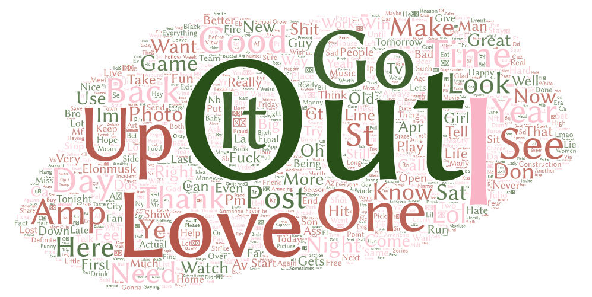

# Geo-tagged Search and Word Analysis 
I tried to use web crawling to get some of data using twitter API to get opinions of people in the US (except Alaska and Hawaii), generating maps and word analysis with Word Art website. 

# Maps of Cats and Dogs
Cats' Map:

Dogs' Map:

Generally, both cats and dogs keywords are shown in the same area in the US and the place where comments take place is almost the same. Some places might prefer cats over dogs whereas some places mights prefer dogs over cats. I think such difference come from the time when we scrape the twitter texts. 

# Word Analysis for Cats and Dogs

As a matter of fact, I don't really think the word analysis will make much sense granted it shows the frequency of the words from the texts. Users on Twitter often use "cats" or "dogs" on rather irrelated topics and I think it is better to refine in a different way. I think such irregularity causes the differences in word analysis. 
